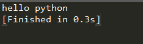
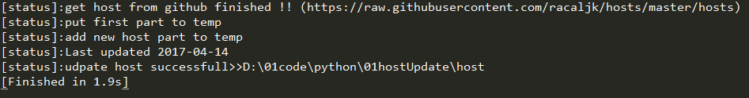

## 更新host文件 实现翻墙

[TOC]

## 更新host 实现翻墙
> 1. 从网上获取host文件内容 :https://raw.githubusercontent.com/racaljk/hosts/master/hosts
> 2. 将获取到的内容中 start 与end 间的部分添加到本地host文件后  
> 其中:
```
 start = "# Modified hosts start"
 end   = "# Modified hosts end"
```
> 3. 本地Host文件地址:C:\Windows\System32\drivers\etc

---

> 说明: 以下代码 使用python  直接从github获取host文件,并将需要更新部分的内容添加到本地host文件中 
> 避免每次更新,都需要从网上获取host内容 同时练习一下python的基础知识

#### 0. 准备工作 :开发环境搭建
> 搭建python开发环境(本人使用sublimetext3作为编辑器):
>安装requests第三方库 
> 参考博客:http://blog.csdn.net/shanzhizi/article/details/50903748

使用git clone reqquests到本地 ,然后将request包放到python安装目录下的Libs 下

##### 1 sublimetext3 编辑python代码 保存为python.py

```python
print ("hello python")

```

##### 2 sublimeytex3 使用ctrl+B 运行python代码:
> 可以看到运行结果如下
 


#### 1. 从github 获取最新host文件内容,保存到githost  中

```
import requests
res = requests.get("https://raw.githubusercontent.com/racaljk/hosts/master/hosts")
savefile = open("githost","wb")
savefile.write(res.content)
savefile.close() 
print ("[status]:"+"get host from githubfinished !! "  +"(https://raw.githubusercontent.com/racaljk/hosts/master/hosts)")
```


#### 2. 截取本地host文件前半部分内容

```
# 从本地host文件中截取前半部分内容>保存到temp文件中
import os
# desk = "C:\\Users\\chen\\Desktop"
# temppath = os.path.join(desk,"temp")
temp = open("temp",'w')
file = open("host")
ant = "# Modified hosts start"

while 1:
    line = file.readline()

    if ant in line:
        print("[status]:"+"update first part to temp")
        break
        pass
    temp.write(line)
    if not line:
        break
    pass # do something
file.close()
temp.close()
```


#### 3. 从githost 中截取后半部分内容( 需要更新的数据 )  

```
#将githost文件中start 和end 中间部分内容追加到temp后面
#1. 按行读取文件(截取star和end中间部分内容)
start = "# Modified hosts start"
end = "# Modified hosts end"
file = open("githost")
flag = 0

temp = open("temp",'a+')
timetap = "# Last updated:"
update = ""
while 1:
    line = file.readline()

    if timetap in line: #保存更新时间
        update = line.replace(timetap,"Last updated").replace("\n","")
        # temp.write(line)
        pass
    if start in line:#设置标记位 此行以后所有内容都追加到temp 中
        flag = 1
        pass

    if flag == 1:
        temp.write(line) #将githost 中start 和 end 中间的内容追加到temp 后
        pass
    if not line:
        break
    pass # do something
file.close()
temp.close()

```

#### 4. 删除临时文件  更新host文件

```
# 3. 删除老的文件 host  将temp 命名为 host
pwd = os.getcwd()
githost_path = os.path.join(pwd,"githost")
os.remove(githost_path)
host_path = os.path.join(pwd,"host")
# os.remove(host_path)

temp_path = os.path.join(pwd,"temp")

# host_path = os.path.join(pwd,"host")
os.remove(host_path)
os.rename(temp_path,host_path)

print("[status]:"+"udpate host successfull>>"+host_path)

```


#### 5 程序运行结果
 


## 完整程序代码   
```
#! /usr/bin/python

#0 准备工作:从github 获取更新的host文件 保存到githost
import requests
res = requests.get("https://raw.githubusercontent.com/racaljk/hosts/master/hosts")
savefile = open("githost","wb")
savefile.write(res.content)
savefile.close() 
print ("[status]:"+"get host from githubfinished !! "  +"(https://raw.githubusercontent.com/racaljk/hosts/master/hosts)")

#1 从本地host文件中截取前半部分内容
import os
# desk = "C:\\Users\\chen\\Desktop"
# temppath = os.path.join(desk,"temp")
temp = open("temp",'w')
file = open("host")
ant = "# Modified hosts start"

while 1:
    line = file.readline()

    if ant in line:
        print("[status]:"+"update first part to temp")
        break
        pass
    temp.write(line)
    if not line:
        break
    pass # do something
file.close()
temp.close()

#2 将githost文件中start 和end 中间部分内容追加到temp后面
#2.1 按行读取文件(截取star和end中间部分内容)
start = "# Modified hosts start"
end = "# Modified hosts end"
file = open("githost")
flag = 0

temp = open("temp",'a+')
timetap = "# Last updated:"
update = ""
while 1:
    line = file.readline()

    if timetap in line: #保存更新时间
        update = line.replace(timetap,"Last updated").replace("\n","")
        # temp.write(line)
        pass
    if start in line:#设置标记位 词行以后所有内容都追加到temp 中
        flag = 1
        pass

    if flag == 1:
        temp.write(line)
        pass
    if not line:
        break
    pass # do something
file.close()
temp.close()
print("[status]:"+update)
print("[status]:"+"add new host part to temp")


# 3. 删除老的文件 host  将temp 命名为 host
pwd = os.getcwd()
githost_path = os.path.join(pwd,"githost")
os.remove(githost_path)
host_path = os.path.join(pwd,"host")
# os.remove(host_path)

temp_path = os.path.join(pwd,"temp")

# host_path = os.path.join(pwd,"host")
os.remove(host_path)
os.rename(temp_path,host_path)

print("[status]:"+"udpate host successfull>>"+host_path)


```


